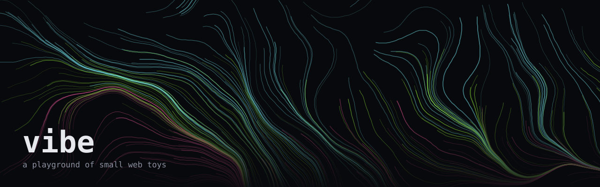

<p align="center">
  
</p>

<p align="center">
  <a href="README.md">English</a> · <strong>简体中文</strong>
</p>

我的游乐场。写点好玩的小东西，零依赖、零构建，点开就能玩。

**→ [在线玩](https://huccct.github.io/vibe/)**

## 现在有什么

| | 玩意儿 | 是什么 |
| --- | --- | --- |
| 🐉 | [山海异兽图鉴](toys/shan-hai-beasts/) | 翻一页，遇见一只没有被古书记下的异兽 |
| 🖌️ | [重力书法](toys/gravity-calligraphy/) | 写下的墨迹不肯待在纸上。松手后整笔坠落，重力和风说了算 |
| 🏮 | [皮影戏](toys/shadow-play/) | 华县碗碗腔皮影戏台。牵命签走位，等锣点接下一手，把《三打白骨精》演活。能收成 GIF |
| 🌊 | [flow field](toys/flow-field/) | 几千个粒子跟着噪声场漂，拖尾积成流线。鼠标能推开它们 |
| 🔉 | [chladni](toys/chladni/) | 驻波方程的节线。一万两千颗沙子自己找到不振动的地方待着 |
| 🩸 | [pixel sort](toys/pixel-sort/) | 像素按亮度排成拉丝故障感。能拖自己的图进去，能下载 |

## 有好点子？

这是个人玩票性质的仓库，我按自己的兴趣往里加东西，不追求覆盖面也不保证维护节奏。

但**非常欢迎开 issue 丢点子** —— 见过什么有意思的视觉效果、算法、物理现象，觉得做成小玩具会好玩的，都可以说。想自己动手实现也行，看下面「[加一个新玩意儿](#加一个新玩意儿)」。

## 跑起来

```bash
pnpm dev
```

打开 http://localhost:4173 。

没有 npm 依赖，也没有构建步骤 —— 全是原生 ES module，浏览器直接跑。`pnpm dev` 跑的是 [scripts/serve.mjs](scripts/serve.mjs)，五十行、只用 Node 自带模块的静态服务（ES module 不能从 `file://` 加载，所以得有个 server）。它发 `no-store`，这条比听起来重要：会回 `304` 的服务器会让浏览器继续用旧的 ES module 或 `registry.json`，最后你调的是一个「一半新一半旧」的页面。

## 加一个新玩意儿

```bash
pnpm new wave-clock
```

生成 `toys/wave-clock/`，里面是一个能跑的骨架（一个转圈的点）。改 `main.js` 写你的想法，改 `meta.json` 里的描述和配色，然后：

```bash
pnpm sync
```

`sync` 扫所有 `toys/*/meta.json` 汇总成 `toys/registry.json`，画廊首页读这个文件。**加完记得跑一次**，CI 会检查它是不是最新的，不然会挂。

约定就三条：每个 toy 一个目录、必须有 `meta.json`、顶栏留一个回首页的链接。其他随便 —— 想用别的技术栈就用，只要 `toys/<slug>/index.html` 能打开。

## 结构

```
index.html            画廊首页
src/gallery/          首页的样式和渲染逻辑
src/shared/           所有 toy 共用的东西
  stage.js              canvas 样板：DPR 缩放、resize、动画循环、指针追踪
  noise.js              2D 梯度噪声 + fBm
  vibe.css              暗色底、等宽字、控件样式
toys/<slug>/
  index.html            页面（顶栏 + 控件 + 舞台）
  main.js               逻辑
  meta.json             标题、描述、标签、配色
toys/registry.json    由 pnpm sync 生成，别手改
scripts/banner.mjs    重新生成上面那张 banner，用的是本仓库自己的 noise.js
```

`stage.js` 和 `noise.js` 是自己写的，没引包，想抄走单独用也没问题。

## 部署

推到 `main` 自动发到 GitHub Pages（见 [deploy.yml](.github/workflows/deploy.yml)）。

没有构建产物，直接把整个仓库当静态站发。所有路径都是相对的，所以子路径（`/vibe/`）和根域名都能用。

## 授权

[MIT](LICENSE)。随便拿去用。
